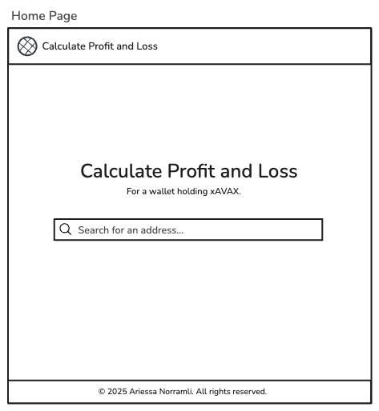
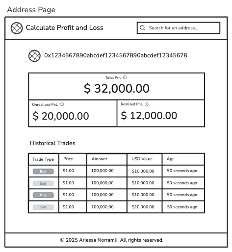
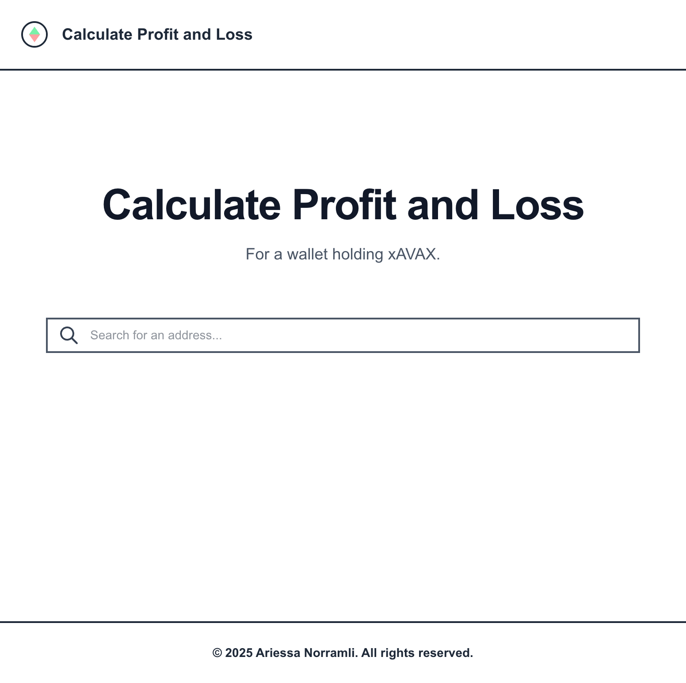
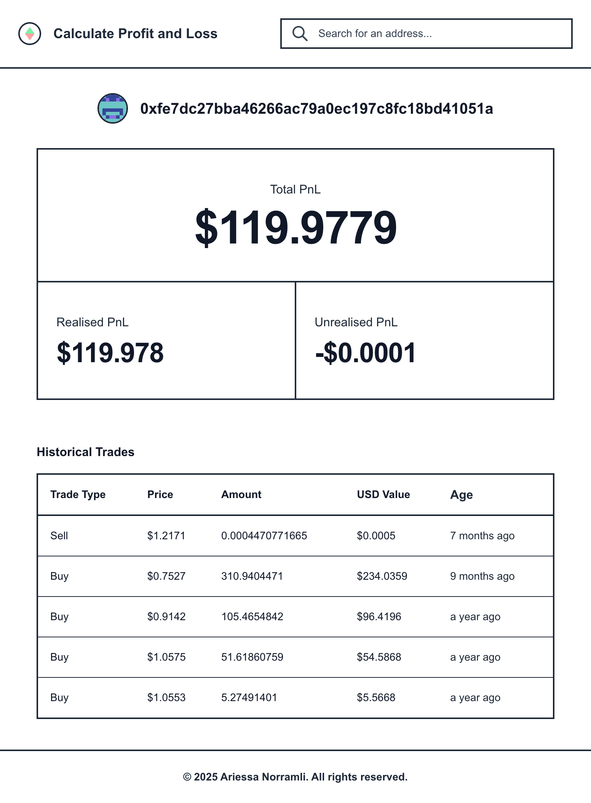

# Calculate Profit and Loss - Frontend

A frontend app that calculates and displays the Profit and Loss (PnL) of a wallet address holding xAVAX tokens on the Avalanche C-Chain. It queries a backend API to fetch transaction history and PnL breakdown.

<br />

**Table of Contents**

- [Tech Stack](#tech-stack)
- [Low Fidelity Wireframes](#low-fidelity-wireframes)
    - [Home Page](#home-page)
    - [Address Page](#address-page)
- [User Interfaces](#user-interfaces)
- [Installation](#installation)
  - [Prerequisites](#prerequisites)
  - [Setup](#setup)
- [License](#license)

<br />

## Tech Stack

- **Framework**: Next.js
- **Library**: React.js
- **Styling**: Tailwind CSS
- **Deployment**: Vercel

<br />

## Low Fidelity Wireframes

### Home Page



<br />

### Address Page



<br />

## User Interfaces

### Home Page



<br />

### Address Page



<br />

## Installation

> ⚠️ These instructions are tailored for macOS systems with Apple Silicon.

Make sure that you have the following versions:

- **Node.js**: `v24.x`
- **npm**: `v11.x` or later

If you’re using `nvm`, you can install and use Node 24 like this:

```bash
nvm install 24
nvm use 24
```

You can verify versions with:

```bash
node -v
npm -v
```

<br />

### Prerequisites

- Git
- Node.js (v24)
- npm (v11)
- nvm (recommended for managing Node versions)

<br />

### Setup

1. Clone the repository

  ```bash
  git clone https://github.com/your-username/your-repo.git
  cd your-repo
  ```

2. Install dependencies

  ```bash
  npm install
  ```

3. Run the development server

  ```bash
  npm run dev
  ```
4. Open your browser and navigate to http://localhost:3000

<br />

## License

Calculate Profit and Loss - Frontend is licensed under the [GNU GPLv3 License](LICENSE).
